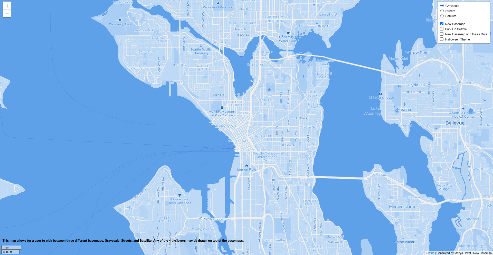
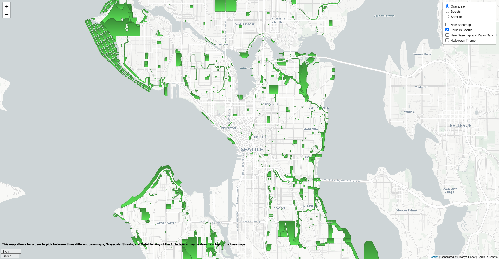
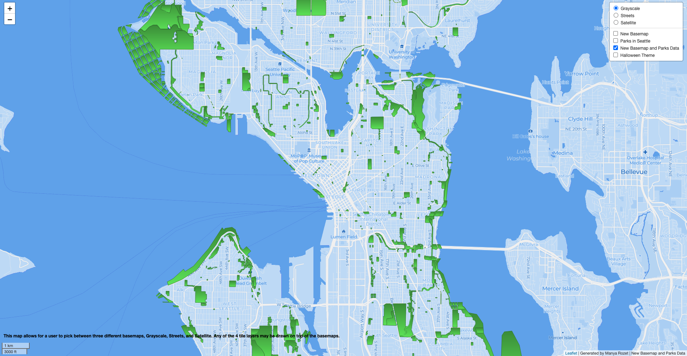
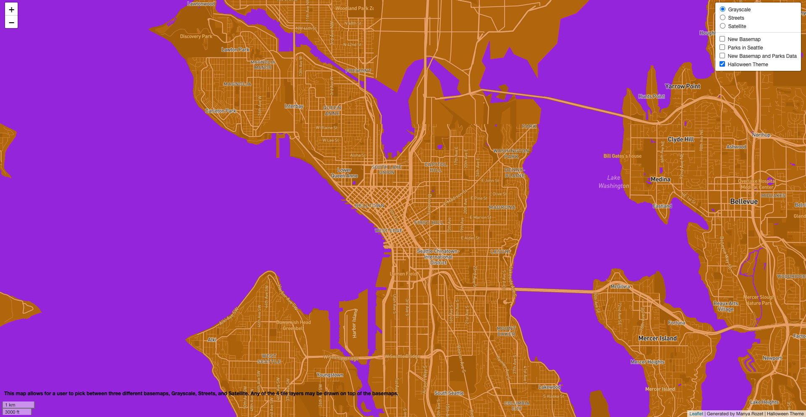

# GEOG 458 Lab 4: Map and Tile Design

For this project, I examine Seattle and surrounding areas. Zoom levels for my tiles are from 1 to 14. I also include a description of the function of this map in the lower left hand corner.

The map can be accessed via: https://m-rozet.github.io/GEOG-458-Lab-4

Tile 1 is a new basemap that I created on Mapbox. Using the Monochrome template, I adjusted the colors of land and water, as well as the roads. Additionally, I changed the font to Garamond and added ferry routes, as well as a ferry icon, seen at a closer zoom level.

Tile 2 illustrates the boundaries of parks in Seattle. This data was gathered from Seattle GeoData, a city database storing a variety of geospatial information.

Tile 3 illustrates the park data in combination with the new basemap I created for Tile 1.

Tile 4 is a new basemap that I created on Mapbox with a Halloween theme. I adjusted the color scheme to include orange, purple, and black.

